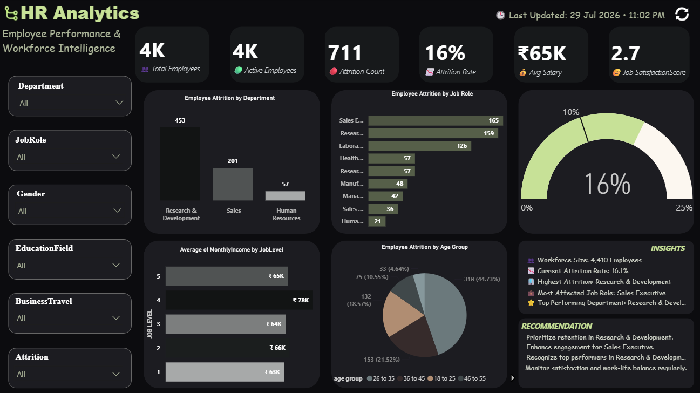
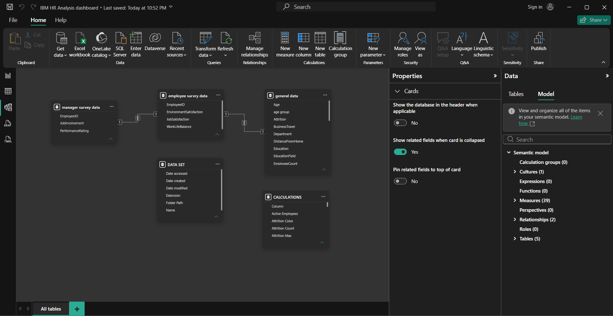
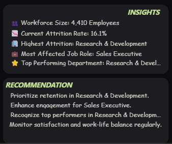

# 📊 HR Analytics Dashboard | End-to-End Power BI Business Intelligence Project

<p align="center">


</p>

---

# 📌 Project Overview

Human Resources teams collect large amounts of employee data every day, but raw data alone cannot answer important business questions.

This project demonstrates how Business Intelligence can transform HR data into meaningful insights that help organizations improve employee retention, monitor workforce performance, and support data-driven decision-making.

Using Microsoft Power BI, Power Query, DAX, and Data Modeling, I built an interactive HR Analytics Dashboard that enables HR managers and business leaders to quickly identify workforce trends, monitor attrition, evaluate employee satisfaction, and make strategic HR decisions.

Rather than simply creating charts, the objective of this project was to solve real HR business problems through data.

---

# 🎯 Business Problem

Organizations often struggle to answer critical workforce questions such as:

- Why are employees leaving the organization?
- Which departments experience the highest attrition?
- Which job roles are most affected?
- What is the current workforce size?
- How satisfied are employees?
- Are employees maintaining a healthy work-life balance?
- Which age groups require greater retention efforts?
- Which departments consistently perform well?

Without centralized reporting, HR teams spend significant time preparing manual reports instead of focusing on strategic workforce planning.

This dashboard addresses those challenges by providing a centralized, interactive Business Intelligence solution.

---

# 💼 Business Objectives

The primary objective was to develop an executive HR dashboard that enables decision-makers to:

- Monitor workforce performance
- Track employee attrition
- Identify high-risk departments
- Measure employee satisfaction
- Evaluate work-life balance
- Support workforce planning
- Improve employee retention strategies
- Enable faster data-driven HR decisions

---

# 🛠 Tech Stack

- Microsoft Power BI
- Power Query (ETL)
- DAX (Data Analysis Expressions)
- Star Schema Data Modeling
- Interactive Dashboard Design
- Business Intelligence
- Data Visualization

---

# 🔄 Project Workflow

### 1️⃣ Business Requirement Analysis

Understanding HR business objectives and defining key performance indicators.

---

### 2️⃣ Data Collection

Collected HR datasets containing:

- Employee Information
- Employee Survey Data
- Manager Survey Data

---

### 3️⃣ Data Cleaning

Performed data preprocessing using Power Query:

- Removed duplicate records
- Handled missing values
- Fixed inconsistent formatting
- Trimmed unwanted spaces
- Corrected data types
- Validated Employee IDs

---

### 4️⃣ Data Transformation

Applied ETL processes including:

- Merge Queries
- Query Validation
- Column Standardization
- Relationship Preparation

---

### 5️⃣ Data Modeling

Created a clean Star Schema using EmployeeID as the primary relationship.

---

### 6️⃣ DAX Development

Developed dynamic business measures including:

- Total Employees
- Active Employees
- Attrition Count
- Attrition Rate
- Average Salary
- Average Satisfaction
- Highest Attrition Department
- Highest Attrition Job Role
- Best Performing Department
- Dynamic Insights
- Dynamic Recommendations
- Ranking Measures
- Conditional Formatting Measures

---

### 7️⃣ Dashboard Development

Designed a modern dark-themed executive dashboard with dynamic filtering and interactive visuals.

---

# 📈 Dashboard Features

### Executive KPIs

- 👥 Total Employees
- ✅ Active Employees
- 📉 Attrition Count
- 📊 Attrition Rate
- 💰 Average Salary
- 😊 Job Satisfaction Score

---

### Interactive Filters

Users can dynamically filter the dashboard using:

- Department
- Job Role
- Gender
- Education Field
- Business Travel
- Attrition Status

Every visual updates instantly based on filter selection.

---

### Visual Analysis

The dashboard provides insights into:

- Employee Attrition by Department
- Employee Attrition by Job Role
- Employee Attrition by Age Group
- Average Monthly Income by Job Level
- Executive KPI Cards
- Dynamic Business Insights
- Actionable HR Recommendations

---

# 📊 Key Business Insights

The analysis revealed several important workforce trends:

- Research & Development experiences the highest employee attrition.
- Sales Executive is the most affected job role.
- Employees aged 26–35 represent the highest attrition group.
- Overall attrition rate is approximately 16%.
- Average employee satisfaction remains moderate, indicating opportunities for engagement improvement.
- Higher job levels generally receive higher salaries.
- Workforce metrics can be monitored dynamically using interactive filters.

---

# 💡 Business Recommendations

Based on the analysis, HR leadership can consider the following actions:

- Prioritize retention strategies within Research & Development.
- Improve engagement programs for Sales Executives.
- Strengthen employee recognition initiatives in high-performing departments.
- Monitor satisfaction and work-life balance regularly.
- Develop targeted retention plans for employees aged 26–35.
- Use dashboard insights during quarterly workforce planning.

---

# 📂 Dataset

The project combines multiple HR datasets to build a unified analytics model.

Included datasets:

- General Employee Data
- Employee Survey Data
- Manager Survey Data

The datasets were merged using EmployeeID to create a consolidated employee analytics model.

---

# 🧠 Skills Demonstrated

### Business Intelligence

- Dashboard Design
- KPI Development
- Executive Reporting
- Business Storytelling

### Data Analytics

- Data Cleaning
- Data Transformation
- ETL
- Exploratory Data Analysis

### Power BI

- Power Query
- Data Modeling
- Star Schema
- DAX
- Interactive Visualizations

### Business Skills

- HR Analytics
- Workforce Analysis
- Employee Retention Analysis
- Business Recommendations
- Decision Support Reporting

---

# 📸 Dashboard Preview

## Executive Dashboard



---

## Data Model



---

## Business Insights



---

# 📁 Repository Structure

```
HR-Analytics-Dashboard
│
├── Dashboard
│     └── HR Analytics Dashboard.pbix
│
├── Dataset
│     ├── general_data.csv
│     ├── employee_survey_data.csv
│     └── manager_survey_data.csv
│
├── Images
│     ├── dashboard.png
│     ├── insights.png
│     └── data-model.png
│
├── README.md
│
└── LICENSE
```

---

# 🚀 Future Improvements

Potential enhancements for future versions include:

- Department-wise drill-through pages
- Employee retention prediction using Machine Learning
- Workforce forecasting
- Diversity & Inclusion dashboard
- Recruitment pipeline analytics
- HR KPI scorecards
- Power BI Service deployment with Row-Level Security (RLS)

---

# 📬 Connect With Me

**Rehan Khan**

📧 khan2233rehan@gmail.com

💼 LinkedIn: *(www.linkedin.com/in/rehan-khan-163896327)*

💻 GitHub: https://github.com/REHANKHANN20

---

# ⭐ If you found this project useful, consider giving it a Star!

Feedback, suggestions, and contributions are always welcome.
